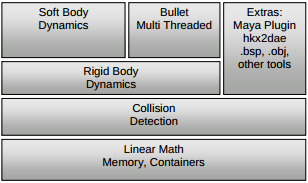
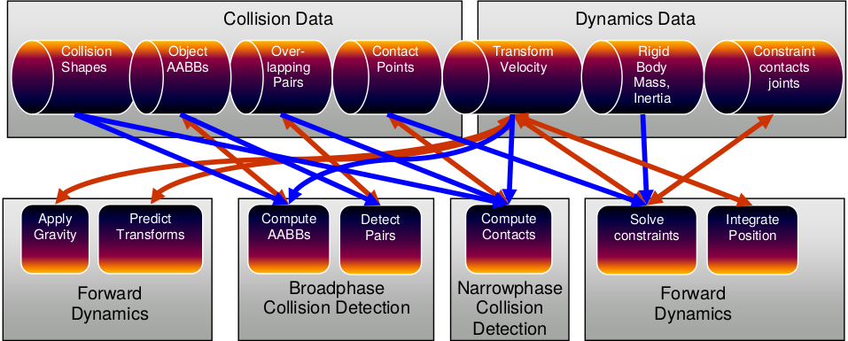
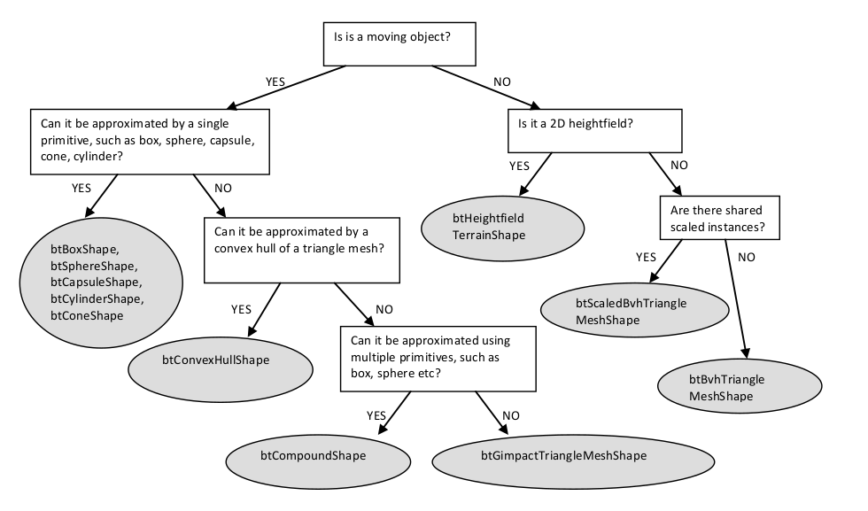

.. title: Introducción a Bullet Physics
.. slug: introduccion-a-bullet-physics
.. date: 2015-02-07 17:21:22 UTC+01:00
.. tags:
.. link:
.. description:
.. type: text

En esta nueva entrada se va a hablar de Bullet Physics, el motor de
físicas y detección de colisiones usado en el proyecto Tinman.Se va a
explicar brevemente la razón de la elección, se enumerarán las
características principales y, a continuación, se mostrará un breve
programa que ilustrará cómo integrar Bullet junto a `Ogre3D
<http://isaaclacoba.github.io/tinman/posts/introduccion-ogre3d/introduccion-a-ogre3d.html>`_,
la biblioteca de renderizado usada en este proyecto.

.. TEASER_END: click to read the rest of the article

************************
¿Qué es Bullet Physics?
************************

`Bullet Physics <http://bulletphysics.org/wordpress/>`_ es una
biblioteca de físicas y detección de colisiones. Se distribuye bajo
licencia ZLib y está desarrollada usando el lenguaje de programación
C++. El código fuente se encuentra disponible en el `repositorio <https://github.com/bulletphysics/bullet3>`_
oficial del proyecto.

Bullet ha sido usado en multitud de películas, tales como Hancock o
Sherlock Holmes, así como videojuegos comerciales AAA, entre los que
destacan Grand Theft auto IV, Grand Theft auto V o Red Dead
Redemption. Como curiosidadw, la NASA está utilizando Bullet en un
`framework <http://bulletphysics.org/wordpress/?p=413>`_ de desarrollo
propio que tiene como propósito el cálculo de integridad tensional en
robots.

Entre las principales característica de Bullet podemos enumerar las siguientes:
- Soporte para una gran multitud de plataformas, tales
como PlayStation 3 y 4, Xbox 360 y One, Wii, Gnu/Linux, Windows,
MacOSX, iPhone, Android y `navegador web
<http://bulletphysics.org/wordpress/?p=333>`_.

- Elección entre precisión simple y doble en operaciones de punto flotante.

- Detección de colisiones, tanto continua como discreta, incluyendo rayqueries y tests de colisión de formas convexas (*sweep test*). Permite realizar test de colisión con mallas convexas y cóncavas, además de con todo tipo de formas primitivas: cubos, esferas, planos, etcétera.

- Dinámica de cuerpos rígidos, de vehículos, controladores de personajes, creación de `ragdolls <http://es.wikipedia.org/wiki/F%C3%ADsica_ragdoll>`_, restricciones de tipo slider, bisagra y 6DOF (6 grados de libertad).

- Dinámica de cuerpos fluidos que permite modelar ropa, tela y volumenes deformables, permitiendo interacción con cuerpos rígidos.

- Existen plugins para dar soporte a Maya, Cinema 4D, está integrado con Blender, soporta ficheros COLLADA.

===================================================
¿Porqué es necesario utilizar un motor de físicas?
===================================================

Como se explicó en el `post anterior
<http://isaaclacoba.github.io/tinman/posts/justificacion-objetivos/justificacion-y-objetivos-del-proyecto.html>`_,
uno de los objetivos de este proyecto es desarrollar un videojuego de
carreras 3D. Aunque se trata de un videojuego arcade, es necesario
modelar el comportamiento del coche de una forma mínimamente realista,
además de poder detectar y gestionar colisiones entre los coches y el
escenario.

Como puede verse en este `artículo
<http://www.asawicki.info/Mirror/Car%20Physics%20for%20Games/Car%20Physics%20for%20Games.html>`_
modelar el comportamiento de un coche presenta algunos problemas,
entre los que podemos destacar la distribución de la carga del coche
derivada de la aceleración y frenado de este o la gran cantidad de
propiedades físicas que intervienen en el movimiento del coche, como
la tracción, el par motor que se ejerce sobre las ruedas a través de
la transmisión, la inercia del coche, etcétera.

El uso de un motor de físicas nos permite juegos mas realistas, al
tiempo que abstrae al desarrollador de los detalles de bajo nivel, ofreciéndonos una implementación bien probada y eficiente.

==============================================================
¿Porqué elegir Bullet antes que otras bibliotecas de físicas?
==============================================================

Unas de los requisitos que existen en este proyecto es el uso de
tecnologías de código libre. A la hora de elegir un motor de físicas se descartaron por defecto los motores comerciales privativos, entre los que se pueden destacar Havok y PhysX. Entre los motores libres, se encontraron tres que podrían competir en calidad con los dos mencionados anteriormente: Bullet Physics, Open Dynamics Engine (mas conocido como ODE) y Newton Physics.

Se eligió Bullet debido a que de los tres motores anteriores, era el que mas facilidades daba a la hora de integrarlo con OGRE3D, ofrece dinámica de vehículos basada en rayqueries, es un proyecto mas moderno y mirando a largo plazo, el equipo de desarrollo de Bullet está actualmente implementando soporte sobre GPU sin necesidad de usar OpenCL ni Cuda. Bullet en su versión 2.8 ofrece soporte para las dos bibliotecas anteriores. Por último, el hecho de que existan proyectos comerciales de gran renombre, como es la saga *Grand Thef Auto*, terminaron de decantar la balanza a favor de esta biblioteca.

Aunque es cierto que los tres motores de físicas ofrecen
implementaciones de dinámica de cuerpos rígidos muy eficientes, una
búsqueda por las páginas oficiales de los proyectos revela que Bullet
es el más activo de los tres, disponiendo de una mayor cantidad de
documentación, teniendo como único punto negativo que la documentación
del `API <http://bulletphysics.org/Bullet/BulletFull/annotated.html>`_
no ofrece información acerca del uso de los métodos, mas allá del
nombre del mismo y una referencia a la línea en la que se encuentra la
definición de dicho método dentro del fichero fuente donde se haya
implementado.

Todas estas razones sumadas han hecho que se elija Bullet Physics como motor de físicas en este proyecto.

**************
Arquitectura
**************

Bullet ha sido diseñado para ser modular y adaptable. La biblioteca da
la libertad al desarrollador de usar los componentes que necesite en
cada momento, ignorando los demás. Por ejemplo, se podría hacer uso de
la capa de detección de colisiones sin hacer uso de las capas
superiores. En la siguiente figura se puede observar un esquema
general de la organización por capas de la biblioteca.

=========================================
Pipeline de simulación de cuerpos rígidos
=========================================

El siguiente diagrama muestra las estructuras de datos mas
importantes, así como las etapas del encauzamiento dentro de
Bullet. Este encauzamiento se ejecuta de izquierda a derecha,
comenzando por aplicar la gravedad y terminando por integrar las
posiciones de los cuerpos.

El encauzamiento y las estructuras de datos están representados en
Bullet a través de la clase DynamicsWorld. Cuando se ejecuta el método
"stepSimulation de dicha clase, en realidad se está ejecutando el
encauzamiento anterior. La implementación por defecto se encuentra en
la clase btDiscreteDynamicsWorld.

Bullet permite trabajar al desarrollador con subfases del
encauzamiento, como la de detección de colisiones, la fase en la que
se aplican los efectos de las colisiones a los cuerpos
físicos(narrowphase) o la fase de resolución de restricciones.

**********************
Veamos algo de código
**********************
A continuación veremos un sencillo ejemplo en el que generaremos
esferas que rebotarán contra el suelo. Estas esferas se crearán
dinámicamente al pulsar la tecla 'B'.

Usaremos la biblioteca `OIS <http://sourceforge.net/projects/wgois/>`_
para gestionar los eventos de teclado y Ogre3D como motor de
renderizado, que nos permitirá representar la escena. En este post se
dará por supuesto los conceptos básicos de Ogre3D. Para el lector que
no esté acostumbrado a trabajar con esta biblioteca, se aconseja
conocer al menos como inicializar el motor de renderizado, así como
gestionar nodos de escena y entidades. El código fuente se puede
encontrar en el repositorio de este `tutorial
<https://bitbucket.org/IsaacLacoba/intro-bullet>`_.

=============
Instalación
=============
Las explicaciones dadas en este post están orientadas a un sistema operativo GNU/Linux. En el repositorio anterior podemos encontrar un fichero `DEPENDS <http://goo.gl/cKHhq9>`_ donde se listan los paquetes necesarios. Para instalar dichos paquetes tan sólo tenemos que ejecutar en un terminal los siguientes comandos. Para instalar Ogre, así como algunas dependencias de OpenGL y el driver gráfico mesa:

.. code:: bash

  sudo apt-get install libogre-1.8.0 libogre-1.8-dev freeglut3-dev libfreetype6 libfreetype6-dev libgl1-mesa-dev libgl1-mesa-glx

En el caso de OIS:

.. code:: bash

  sudo apt-get install libois-1.3.0 libois-dev

Y en el de Bullet:

.. code:: bash

  sudo apt-get install libbullet-dev libbullet2.82-dbg libbullet-extras-dev

==============
Inicialización
==============
En este ejemplo, todo lo relativo a la inicialización de Bullet se
puede encontrar en los ficheros `physics.cpp <https://bitbucket.org/IsaacLacoba/intro-bullet/src/ed9787be35bf81cb7cc61246e73729d96a42d374/src/managers/physics.cpp?at=master>`_ y
`physics.h <https://bitbucket.org/IsaacLacoba/intro-bullet/src/ed9787be35bf81cb7cc61246e73729d96a42d374/src/managers/physics.h?at=master>`_. En él, se van a modelar las esferas usando cuerpos
rígidos. Los cuerpos rígidos tienen como principal característica que
no se deforman; es decir, la distancia entre cualquier par de vértices
que forman la malla nunca varía. Por el contrario, los cuerpos fluidos
son aquellos que permiten deformaciones. En este post se va a
intentar obviar toda la base matemática y se va a centrar la
explicación en los aspectos referentes a la biblioteca.

El elemento mas importante en Bullet es el *Mundo*. El *Mundo*
dentro de Bullet tiene varias responsabilidades, entre las que
podemos destacar:

- servir como estructura de datos donde almacenar los cuerpos
  físicos que lo conforman.
- aplicar una serie de restricciones a estos cuerpos, como la
  fuerza de la gravedad, detectar y aplicar colisiones entre estos
  cuerpos y actualizar su posición automáticamente cuando se aplique
  cualquier tipo de fuerza sobre estos.

El *Mundo* tiene diversas implementaciones dentro de la bibilioteca,
dependiendo de si utilizamos cuerpos rígidos o fluidos.  En este caso
se están usando cuerpos rígidos, de modo que la clase que se utilizará
será `btDiscreteDynamicsWorld
<http://bulletphysics.org/Bullet/BulletFull/classbtDiscreteDynamicsWorld.html>`_. En el siguiente listado de código se muestra el constructor del gestor de
físicas, que inicializa el objeto *btDiscreteDynamicsWorld*:

.. code:: c++

   Physics::Physics(btVector3 gravity) {
          gravity_ = gravity;

          broadphase_ = new btDbvtBroadphase();

          solver_ = new btSequentialImpulseConstraintSolver();
          collision_configuration_ = new btDefaultCollisionConfiguration();
          dispatcher_ = new btCollisionDispatcher(collision_configuration_);
          dynamics_world_ = new btDiscreteDynamicsWorld(dispatcher_,
          broadphase_, solver_, collision_configuration_);
          dynamics_world_->setGravity(gravity_);
   }

Cada uno de los objetos que recibe el constructor de la clase
*btDiscreteDynamicsWorld* corresponde con una de las fases del
pipeline físico. El objeto broadphase corresponde a la fase de
detección de colisiones. Existen tres implementaciones de esta fase
que trabajan con diferentes estructuras de datos, lo que permite
acelerar la búsqueda de pares de colisión dependiendo de nuestras
necesidades:

- `btDbvtBroadphase <http://bulletphysics.org/Bullet/BulletFull/structbtDbvtBroadphase.html>`_ usa una jerarquía de volumenes delimitantes
  basada en un arbol AABB.

- `btAxisSweep3 <http://www.bulletphysics.com/Bullet/BulletFull/classbtAxisSweep3.html>`_ y `bt32BitAxisSweep3 <http://bulletphysics.org/Bullet/BulletFull/classbt32BitAxisSweep3.html>`_ implementa  un algoritmo 3d de barrido y poda.

- `btCudaBroadphase <http://bullet.googlecode.com/svn/trunk/Extras/CUDA/btCudaBroadphase.h>`_ implementa un grid usando el hardware de la
  GPU. Hace uso de Cuda, una tecnología para tarjetas gráficas Nvidia.

La fase de detección de colisiones hace uso de una serie de estructuras de datos:

- `btCollisionObject <http://bulletphysics.org/Bullet/BulletFull/classbtCollisionObject.html>`_:
  almacena formas de colisión y las transformaciones de éstas.

- `btCollisionShape <http://bulletphysics.org/Bullet/BulletFull/classbtCollisionShape.html>`_:
  describe la forma de colisión de un objeto de colisión, tal como una
  caja, una esfera, una forma convexa(convex hull) o una malla de
  triángulos. Una forma de colisión puede ser compartida entre
  múltiples objetos de colisión.

- `btGhostObject <http://bulletphysics.org/Bullet/BulletFull/classbtGhostObject.html>`_: es un
  caso especial de cuerpo de colisión útil para realizar consultas de
  colisión de una forma rápida.

- `btCollisionWorld <http://bulletphysics.org/Bullet/BulletFull/classbtCollisionWorld.html>`_:
  almacena todos los objetos de colisión y proporciona una interfaz
  que permite realizar peticiones de forma eficiente. Nuestro objeto
  dynamics\_world\_ es de tipo btDiscreteDynamicsWorld, que es una
  subclase de ésta.

El objeto dispatcher\_ pertenece a la clase `btCollisionDispatcher <http://bulletphysics.org/Bullet/BulletFull/classbtCollisionDispatcher.html>`_, la
cuál ofrece algoritmos que manejan pares de colisión ConvexConvex y
ConvexConcave. Esta clase corresponde a la etapa *Narrowphase*, usando
los pares de colisión generados en la fase *Broadphase*.

El objeto collisionConfiguration\_, de la clase
`btDefaultCollisionConfiguration
<http://bulletphysics.org/Bullet/BulletFull/classbtDefaultCollisionConfiguration.html>`_,
ofrece una configuración por defecto que define aspectos internos del
asignador de la pila de detección de colisiones, del asignador de la
pila de memoria de bullet, etcétera.

Por último, el objeto solver\_, de la clase
`btSequentialImpulseConstraintSolver <http://bulletphysics.org/Bullet/BulletFull/classbtSequentialImpulseConstraintSolver.html>`_, ofrece una implementación del
método `Gauss-Seidel <http://es.wikipedia.org/wiki/M%C3%A9todo_de_Gauss-Seidel>`_ usado en analisis numérico para resolución de
sistemas de ecuaciones lineales. Esta clase está implementada usando paralelización SIMD(*Single Instruction, Multiple Data*), una técnica
utilizada para conseguir paralelismo a nivel de datos. Sin entrar en
detalles, consiste en aplicar una misma operación sobre un conjunto de
datos.

Tras inicializar la biblioteca, el siguiente paso consiste en crear
cuerpos y formas de colisión.

===========================================
Creando los cuerpos rígidos de las esferas
===========================================

El siguiente listado de código muestra cómo se crean los cuerpos
rígidos en nuestro ejemplo:

.. code:: c++

	btRigidBody*
	Physics::create_rigid_body(const btTransform &worldTransform,
	                  Ogre::SceneNode* node,
	                  btCollisionShape* shape,
	                  btScalar mass){
	  btVector3 inertia(0 ,0 ,0);

	  if(mass != 0)  shape->calculateLocalInertia(mass, inertia);

	  MotionState* motionState = new MotionState(worldTransform, node);
	  btRigidBody::btRigidBodyConstructionInfo
	    rigidBodyCI(mass, motionState, shape, inertia);

	  btRigidBody* rigidBody = new btRigidBody(rigidBodyCI);
	  dynamics_world_->addRigidBody(rigidBody);

	  return rigidBody;
	}

El constructor de la clase `btRigidBody <http://bulletphysics.org/Bullet/BulletFull/classbtRigidBody.html>`_ recibe un objeto `btRigidBody::btRigidBodyConstructionInfo <http://bulletphysics.org/Bullet/BulletFull/structbtRigidBody_1_1btRigidBodyConstructionInfo.html>`_. Este objeto sirve para inyectar al constructor de la clase información relativa al cuerpo rígido que se va a crear . Los argumentos que recibe son la masa del objeto, el estado del cuerpo(*Motion State* del cuál
hablaremos mas adelante), la forma física del cuerpo(*btCollisionShape*) y el vector de inercia.

En el método *Physics::create\_rigid\_body*, listado anteriormente, se
comprueba que la masa del cuerpo sea distinta de cero, ya que Bullet
interpreta que un cuerpo sin masa es equivalente a uno con masa
infinita; es decir, es inamovible. A partir de la forma del cuerpo y
de la masa de este, Bullet calcula la inercia del cuerpo físico que
estamos construyendo a través del método
*btCollisionShape::calculateLocalInertia*. Una vez creado el cuerpo, hay que
añadirlo al mundo a través del método btDiscreteDynamicsWorld::addRigidBody.

Bullet ofrece una gran variedad de formas primitivas de colisión, entre las que podemos listar:

- `btBoxShape <http://bulletphysics.org/Bullet/BulletFull/classbtBoxShape.html>`_: caja definida por el tamaño de sus lados.
- `btSphereShape <http://bulletphysics.org/Bullet/BulletFull/classbtSphereShape.html>`_: esfera definida por su radio.
- `btCapsuleShape <http://bulletphysics.org/Bullet/BulletFull/classbtCapsuleShape.html>`_: capsula alrededor del eje Y. Tambien existen btCapsuleShapeX/Z.
- `btCylinderShape <http://bulletphysics.org/Bullet/BulletFull/classbtCylinderShape.html>`_.
- `btConeShape <http://bulletphysics.org/Bullet/BulletFull/classbtConeShape.html>`_: cono alrededor del eje Y. Tambien existen btConeShapeX/Z.
- `btMultiSphereShap <http://bulletphysics.org/Bullet/BulletFull/classbtMultiSphereShape.html>`_: cascarón convexo formado a partir de varias esferas que puede ser usado para crear una capsula( a partir de dos esferas) u otras formas convexas.

Bullet tambien ofrece formas compuestas, pudiendo combinar múltiples
formas convexas en una única usando la clase `btCompoundShape <http://bulletphysics.org/Bullet/BulletFull/classbtCompoundShape.html>`_. Cada una de las formas que dan lugar a la malla principal se llama *forma hija*. Cada *forma hija* tiene sus propias transformaciones locales, relativas a la forma compuesta. Existen algunas formas de colisión mas avanzadas que
permiten ajustarse a geometrías que no corresponden con formas
primitivas. Para mas información, se aconseja consultar el `manual
oficial <http://www.cs.uu.nl/docs/vakken/mgp/assignment/Bullet%20-%20User%20Manual.pdf>`_ de Bullet. En la figura siguiente se muestra que ayuda en la elección de la forma  de colisión adecuada dependiendo de la situación.

Ya se ha visto la lógica que permite crear cuerpos rígidos, de modo que sólo queda crear nuestras esferas:

.. code:: c++

	void
	Game::create_sphere() {
	  create_graphic_element(); //crea un nodo y una entidad de Ogre
	  create_physic_element();
	}

	void
	Game::create_physic_element() {
		btQuaternion rotation = btQuaternion(btVector3(1, 1, 1),
		                                     random_.real(0.f, 90.f));
		btVector3 translation = btVector3(0, 100, 0);
		btTransform transform = btTransform( rotation, translation);

		int mass = 80;
		btScalar radio(5);
		btSphereShape* sphere_shape =
		      physics_->create_shape(radio);

		ball_bodies.push_back(physics_->
		  create_rigid_body(transform, ball_nodes.back(), sphere_shape, mass));
		ball_bodies.back()->setRestitution(0.8f);
		ball_bodies.back()->setFriction(1.5f);
	}

En el listado anterior se crea el cuerpo rígido y la forma de colisión de la esfera. Para construir el cuerpo rígido, se crea un `btTransform <http://bulletphysics.org/Bullet/BulletFull/classbtTransform.html>`_ que recibe un cuaternio y un vector. El cuaternio recibe un vector, mediante el cuál le indicamos en qué ejes sufrirá rotaciones nuestra esfera, y un float aleatorio entre 0 y 90, con el que indicamos los grados de rotación. Esto lo hacemos así para que cada bola que creamos rebote de una forma ligeramente distinta contra el suelo. El segundo parámetro de la transformación es el vector de traslación, que indica el lugar donde se creará la esfera. En este caso a 100 unidades sobre el eje Y.

Para crear la forma de colisión esférica, se hace uso de una factoría de btCollisionShape implementada en el gestor de físicas. Lo único que hay que hacer es pasarle el radio de la esfera, en metros, y se creará la forma de colisión.

Con estos parámetros se crea un cuerpo rígido haciendo uso del gestor de físicas. Una vez creado el cuerpo rígido, se configuran el `coeficiente de restitución <http://es.wikipedia.org/wiki/Coeficiente_de_restituci%C3%B3n>`_, que indica una medida del grado de conservación de la energía cinética en un choque entre partículas clásicas, y el `coeficiente de fricción <http://es.wikipedia.org/wiki/Coeficiente_de_rozamiento>`_, que indica la oposición al deslizamiento que ofrecen dos superficies en contacto.

Por último, falta integrar el cuerpo físico de Bullet con el cuerpo gráfico de Ogre.

===========================
Integrar Ogre3D con Bullet
===========================

Primero de todo, hay que entender que los cuerpos gráficos de Ogre3D y
los cuerpos físicos de Bullet son entidades completamente distintas y
separadas. Si no se implementa algún mecanismos mediante el cuál
Bullet actualice la posición y rotación de dicho cuerpo gráfico, se creará una situación de incoherencia en la cuál la posición del cuerpo gráfico permanecerá estática, al contrario que la del cuerpo físico que se verá actualizada. Esto provocará que el vídeo asociado a nuestro juego no se actualice, ya que Ogre es el encargado de crear las imágenes, mientras que Bullet tiene la responsabilidad de modelar un comportamiento realista sobre los cuerpos.

Para solucionar este problema se crea la clase MotionState. Podemos ver su implementación en el siguiente listado:

.. code:: c++

  class MyMotionState : public btMotionState
	{
	protected:
	    Ogre::SceneNode* mSceneNode;
	    btTransform mInitialPosition;

	public:
	    MyMotionState(const btTransform &initialPosition, Ogre::SceneNode *node)
	    {
	        mSceneNode = node;
		mInitialPosition = initialPosition;
	    }

	    virtual ~MyMotionState()
	    {
	    }

	    void setNode(Ogre::SceneNode *node)
	    {
	        mSceneNode = node;
	    }

	    virtual void getWorldTransform(btTransform &worldTrans) const
	    {
	        worldTrans = mInitialPosition;
	    }

	    virtual void setWorldTransform(const btTransform &worldTrans)
	    {
	        if(mSceneNode == nullptr)
	            return; // silently return before we set a node

	        btQuaternion rot = worldTrans.getRotation();
	        mSceneNode ->setOrientation(rot.w(), rot.x(), rot.y(), rot.z());
	        btVector3 pos = worldTrans.getOrigin();
	        mSceneNode ->setPosition(pos.x(), pos.y(), pos.z());
	    }
	};

En el constructor de la clase se le pasa un nodo de escena de Ogre y la transformación inicial de dicho nodo. Es en el constructor de la clase btRigidBody donde se le pasa dicho objeto MotionState, que en nuestro caso se crea dentro del método *Physics::create\_rigid\_body*.

Hecho esto, el método que se encarga de sincronizar la posición del nodo de ogre asociado a un cuerpo rígido es el método *setWorldTransform*. Este método se invoca de forma interna por parte Bullet cada vez que el cuerpo rígido ve modificado su estado en el transcurso normal de la simulación física del *Mundo*.

Por último, sólo queda invocar el método btDiscreteDynamicsWorld::stepSimulation en cada iteración del bucle principal de juego, indicándole el tiempo transcurrido entre la llamada anterior y la siguiente. Dicho método implementa el pipeline físico donde se ejecuta la simulación. En el siguiente listado de código podemos ver el bucle principal del ejemplo:

.. code:: c++

	void
	Game::game_loop() {
	  float delta_time;

	  while(!input_->exit_) {
	    delta_time += timer_.get_delta_time();
	    input_->capture();
	    if(delta_time >= 1/60) {
	      input_->check_events();
	      physics_->step_simulation(delta_time, 32);
	      scene_->render_one_frame();
	      delta_time = 0.f;
	    }
	  }
	}

El método step_simulation  del gestor de físicas simplemente encapsula la misma llamada al objeto *btDiscreteDynamicsWorld*, que recibe como parámetros el delta time que hemos indicado y un entero que indica el número de subpasos que debe realizar dentro de la simulación física a la hora de interpolar la posición de los objetos físicos.

************************
Aclaraciones del autor
************************

En este post he intentado llegar a un equilibrio entre el nivel de profundidad de la explicación de los aspectos relacionados con Bullet y la sencillez del código fuente que ejemplifica dichos conceptos. He intentado que el ejemplo sea lo mas sencillo posible pero con la funcionalidad mínima que permita ver una utilidad real por parte del motor de físicas. Aún así el nivel de complejidad del ejemplo no es todo lo bajo que yo hubiese querido en un principio, pero creo que lo que presento aquí es el ejemplo mínimo de cómo integrar rápidamente Ogre3D con Bullet, de modo que pueda verse reflejado una de las primeras etapas que yo tuve que pasar en el proceso de aprendizaje que he sufrido a lo largo del desarrollo de mi proyecto.
